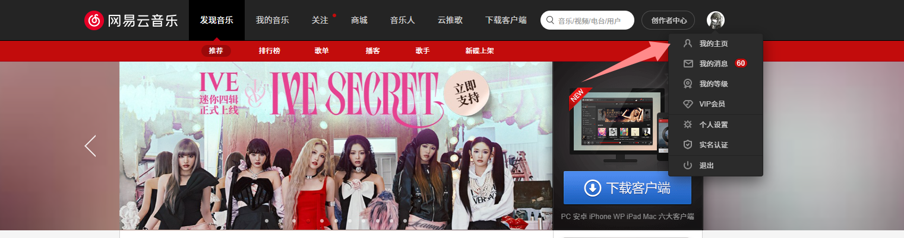
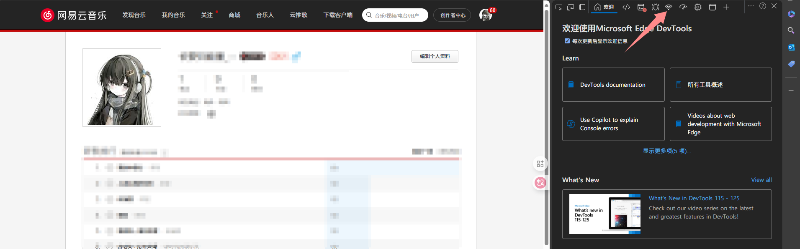
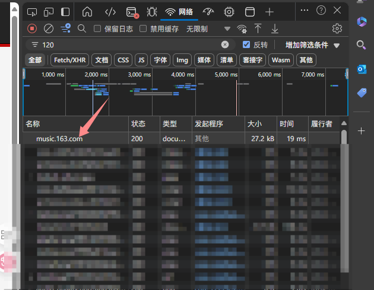
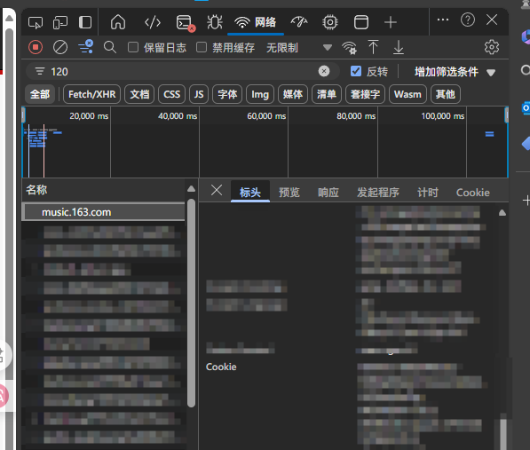

# ZQ-Player 一个简约且强大的音乐播放器

## 🎉 功能

- ✨ 支持扫码登录
- 📱 支持手机号登录（部分地区API可能不稳定）
- 📅 自动每日签到及云贝签到
- 🎨 封面主题色自适应
- 🌚 Light / Dark 模式自动切换
- 🎵 **支持播放部分无版权歌曲（可能与原曲不完全匹配）**
- ⬇️ 下载歌曲（最高支持 Hi-Res）
- ➕ 新建歌单及歌单编辑
- ❤️ 收藏 / 取消收藏歌单或歌手
- 🎶 每日推荐歌曲
- 📻 私人 FM
- ☁️ 云盘音乐上传
- 📂 云盘内歌曲播放
- 🔄 云盘内歌曲纠正
- 🗑️ 云盘歌曲删除
- 📝 支持逐字歌词
- 🔄 歌词滚动及歌词翻译
- 📹 MV 与视频播放
- 🎶 音乐频谱显示
- ⏭️ 音乐渐入渐出
- 🔄 支持 PWA
- 💬 评论区及评论点赞
- 🌓 明暗模式自动 / 手动切换
- 📱 移动端基础适配
- ~~🌐 `i18n` 支持~~


## 📦 桌面版本

本项目本身不提供桌面版本, 但是可以自己构建桌面版本. 桌面端目前处于测试阶段, 部分漏洞可能没能及时修复

1. 本地部署需安装 [Node.js](https://nodejs.org/zh-cn/)。请下载最新稳定版。
2. 安装 pnpm

   ```bash
   npm install pnpm -g
   ```

3. 克隆仓库并拉取至本地，此处不再赘述
4. 使用 `pnpm install` 安装依赖（如遇网络错误可用国内镜像源）
5. 修改`/.env`配置
6. 打包客户端，请根据你的系统类型选择，打包成功后会输出安装包或可执行文件在 `/dist` 目录，可自行安装

   | 命令               | 系统类型 |
   | ------------------ | -------- |
   | `pnpm build:win`   | Windows  |
   | `pnpm build:linux` | Linux    |
   | `pnpm build:mac`   | MacOS    |


## ⚙️ Vercel 部署

### 🔧 部署依赖

1. 本程序依赖 [ZQ-MusicApi](https://github.com/BAYUEQI/ZQ-MusicApi)，请按步骤部署并确保可在线访问。

#### 网易云API部署（网易云音乐API Reborn）

[](https://vercel.com/new/iamhutao-projects/clone?repository-url=https://github.com/BAYUEQI/ZQ-MusicApi)

#### TTML歌词API部署（可选）

[](https://vercel.com/new/iamhutao-projects/clone?repository-url=https://github.com/BAYUEQI/ZQ-Lyrics)

### 🔧 部署本体

#### 通过 Fork 仓库部署

2. 点击本仓库右上角 `Fork`，复制到你的 GitHub 账号
3. 复制 `/.env.example` 文件并重命名为 `/.env`
4. 将 `.env` 文件中的 `RENDERER_VITE_SERVER_URL` 改为第一步得到的 API 地址
5. 将 `.env` 文件中的 `RENDERER_VITE_SITE_URL` 改为你的站点地址，用于解决跨域问题

   ```dotenv
   RENDERER_VITE_SERVER_URL = "https://api.example.com";
   RENDERER_VITE_SITE_URL = "https://player.example.com";
   ```

   > 另一种API填入方式，请在 `vercel.json` 里配置：
   >
   > ```json
   > "rewrites": [
   >   {
   >     "source": "/:path",
   >     "destination": "/index.html"
   >   },
   >   {
   >     "source": "/api/:apiurl*",
   >     "destination": "https://你的网易云api域名/:apiurl*"
   >   }
   > ]
   > ```
   >
   > 随后在 `.env` 里填写：
   >
   > ```
   > ## 使用同级域名API
   > RENDERER_VITE_SITE_ROOT = true
   > ```

6. 将 `Build and Output Settings` 的 `Output Directory` 改为 `out/renderer`


7. 点击 `Deploy`，即可成功部署

## ⚙️ 服务器部署

1. 重复 `⚙️ Vercel 部署` 中的 1 - 4 步骤
2. 克隆仓库

   > 将链接中的 example/repository.git 替换为你要克隆的实际仓库地址

   ```bash
   git clone https://github.com/example/repository.git
   ```

3. 安装依赖

   ```bash
   pnpm install
   # 或
   yarn install
   # 或
   npm install
   ```

4. 编译打包

   ```bash
   pnpm build
   # 或
   yarn build
   # 或
   npm build
   ```

5. 将站点运行目录设置为 `out/renderer`
## 🎵 网易云音乐Cookie获取
1. 使用电脑打开网易云网页
这里推荐使用Edge或Google浏览器，在浏览器访问网易云音乐的官网，登录自己的账号；一切准备就绪后进入个人主页进入下一步操作


3. 使用浏览器开发者工具获取Cookie
进入到个人主页后，按下“F12”键，单击“网络”


此时需要刷新一下页面，按下“Ctrl+R”组合键，此时单击列表出现的第一个选项


进入之后下拉，找到“Cookie”字眼，将`MUSIC_U=xxxx;`全部复制下来（注意！不要复制错了、多了或者少了）



## 📢 免责声明

本项目部分功能使用了网易云音乐的第三方 API 服务，**仅供个人学习研究使用，禁止用于商业及非法用途**。

本项目开发者承诺 **严格遵守相关法律法规和网易云音乐 API 使用协议，不会利用本项目进行任何违法活动。** 如因使用本项目而引起的任何纠纷或责任，均由使用者自行承担。**本项目开发者不承担任何因使用本项目而导致的任何直接或间接责任，并保留追究使用者违法行为的权利**。

请使用者在使用本项目时遵守相关法律法规，**不要将本项目用于任何商业及非法用途。如有违反，一切后果由使用者自负。** 同时，使用者应该自行承担因使用本项目而带来的风险和责任。本项目开发者不对本项目所提供的服务和内容做出任何保证。

感谢您的理解。


## 📂 目录结构

```dir
├── auto-imports.d.ts                     # 自动导入TypeScript声明文件
├── components.d.ts                       # 组件TypeScript声明文件
├── electron-builder.yml                  # Electron Builder配置
├── electron.vite.config.mjs              # Electron Vite配置
├── index.html                            # 主页HTML
├── LICENSE                               # 开源许可证
├── netlify.toml                          # Netlify部署配置
├── nginx.conf                            # Nginx配置
├── package.json                          # 项目配置
├── pnpm-lock.yaml                        # pnpm锁定文件
├── vercel.json                           # Vercel部署配置
├── electron                              # Electron相关文件
│   ├── main                              # 主进程
│   │   ├── index.js                      # 主进程入口
│   │   ├── loginWin.ts                   # 登录窗口
│   │   ├── mainIpcMain.js                # 主进程通信
│   │   ├── startMainServer.js            # 服务器启动
│   │   ├── startNcmServer.js             # 网易云音乐服务启动
│   │   └── utils                         # 工具函数
│   │       ├── checkPort.js              # 端口检查
│   │       ├── checkUpdates.js           # 更新检查
│   │       ├── createGlobalShortcut.js   # 全局快捷键
│   │       ├── createSystemTray.js       # 系统托盘
│   │       ├── getNeteaseMusicUrl.js     # 音乐URL获取
│   │       ├── kwDES.js                  # DES加密
│   │       └── readDirAsync.js           # 异步目录读取
│   └── preload                           # 预加载脚本
│       └── index.mjs                     # 预加载入口
├── public                                # 公共资源
│   ├── favicon.ico                       # 网站图标
│   ├── favicon.png                       # PNG格式图标
│   ├── font                              # 字体文件
│   │   ├── font.css                      # 字体样式
│   │   ├── HarmonyOS_Sans_SC_Bold.woff2
│   │   ├── HarmonyOS_Sans_SC.woff2
│   │   ├── PingFangSC-Bold.woff2
│   │   └── PingFangSC-Regular.woff2
│   └── imgs                              # 图片资源
│       ├── icons                         # 图标
│       └── pic                           # 图片
├── src                                   # 源代码
│   ├── App.vue                           # 根组件
│   ├── env.d.ts                          # 环境变量类型声明
│   ├── main.js                           # 主入口
│   ├── api                               # API接口
│   │   ├── album.js                      # 专辑相关
│   │   ├── artist.js                     # 艺术家相关
│   │   ├── cloud.js                      # 云服务相关
│   │   ├── comment.js                    # 评论相关
│   │   ├── dj.js                         # 电台相关
│   │   ├── login.js                      # 登录相关
│   │   ├── other.js                      # 其他API
│   │   ├── playlist.js                   # 歌单相关
│   │   ├── recommend.js                  # 推荐相关
│   │   ├── search.js                     # 搜索相关
│   │   ├── song.js                       # 歌曲相关
│   │   ├── user.js                       # 用户相关
│   │   └── video.js                      # 视频相关
│   ├── assets                            # 静态资源
│   │   ├── emoji.json                    # 表情配置
│   │   ├── icon.json                     # 图标配置
│   │   ├── idMeta.json                   # ID元数据
│   │   └── themeColor.json               # 主题颜色配置
│   ├── components                        # 组件
│   │   ├── Cover                         # 封面相关组件
│   │   │   ├── CoverDropdown.vue         # 封面下拉组件
│   │   │   ├── CoverPlayBtn.vue          # 封面播放按钮组件
│   │   │   ├── MainCover.vue             # 主封面组件
│   │   │   ├── SpecialCover.vue          # 特殊封面组件
│   │   │   └── SpecialCoverCard.vue      # 特殊封面卡片组件
│   │   ├── Global                        # 全局组件
│   │   │   ├── MainLayout.vue            # 主布局组件
│   │   │   ├── Menu.vue                  # 菜单组件
│   │   │   ├── PageTransition.vue        # 页面过渡组件
│   │   │   ├── Pagination.vue            # 分页组件
│   │   │   ├── Playlist.vue              # 歌单组件
│   │   │   ├── Provider.vue              # 全局化配置组件
│   │   │   └── SvgIcon.vue               # SVG图标组件
│   │   ├── List                          # 列表组件
│   │   │   ├── CommentList.vue           # 评论列表组件
│   │   │   ├── SongList.vue              # 歌曲列表组件
│   │   │   ├── SongListDrawer.vue        # 歌曲列表抽屉组件
│   │   │   └── SongListDropdown.vue      # 歌曲下拉组件
│   │   ├── Modal                         # 弹窗相关组件
│   │   │   ├── AddPlaylist.vue           # 添加歌单组件
│   │   │   ├── CloudSongMatch.vue        # 云盘歌曲匹配组件
│   │   │   ├── CreatePlaylist.vue        # 创建歌单组件
│   │   │   ├── DonateCreator.vue         # 捐赠作者组件
│   │   │   ├── DownloadSong.vue          # 下载歌曲组件
│   │   │   ├── Login                     # 登录相关组件
│   │   │   │   ├── Login.vue             # 登录主组件
│   │   │   │   ├── LoginCookie.vue       # Cookie登录组件
│   │   │   │   ├── LoginPhone.vue        # 手机登录组件
│   │   │   │   └── LoginQRCode.vue       # 二维码登录组件
│   │   │   ├── PlaylistUpdate.vue        # 歌单编辑组件
│   │   │   ├── Settings.vue              # 设置弹窗组件
│   │   │   ├── SongDetail.vue            # 歌曲详情组件
│   │   │   ├── UpCloudSong.vue           # 上传云盘歌曲组件
│   │   │   └── UserAgreement.vue         # 用户协议组件
│   │   ├── Nav                           # 导航相关组件
│   │   │   ├── MainNav.vue               # 主导航组件
│   │   │   └── UserData.vue              # 用户数据组件
│   │   ├── Player                        # 播放器相关组件
│   │   │   ├── AMLyric.vue               # Apple Music风格歌词组件
│   │   │   ├── BackgroundRender.vue      # 背景渲染组件
│   │   │   ├── CountDown.vue             # 倒计时组件
│   │   │   ├── FullPlayer.vue            # 全屏播放器组件
│   │   │   ├── Lyric.vue                 # 歌词组件
│   │   │   ├── MainControl.vue           # 主控制组件
│   │   │   ├── PlayerControl.vue         # 播放器控制组件
│   │   │   ├── PlayerCover.vue           # 播放器封面组件
│   │   │   ├── PrivateFm.vue             # 私人FM组件
│   │   │   └── Spectrum.vue              # 音乐频谱组件
│   │   ├── Search                        # 搜索相关组件
│   │   │   ├── SearchHot.vue             # 热门搜索组件
│   │   │   ├── SearchInp.vue             # 搜索输入组件
│   │   │   └── SearchSuggestions.vue     # 搜索建议组件
│   │   └── WinDom                        # 窗口DOM相关组件
│   │       └── TitleBar.vue              # 标题栏组件
│   ├── router                            # 路由配置
│   │   ├── index.js                      # 路由入口
│   │   └── routes.js                     # 路由定义
│   ├── stores                            # 状态管理
│   │   ├── index.js                      # Store入口
│   │   ├── indexedDB.js                  # IndexedDB相关
│   │   ├── musicData.js                  # 音乐数据
│   │   ├── shortcut.js                   # 快捷键配置
│   │   ├── siteData.js                   # 站点数据
│   │   ├── siteSettings.js               # 站点设置
│   │   └── siteStatus.js                 # 站点状态
│   ├── style                             # 样式文件
│   │   ├── amll.scss                     # AMLL样式
│   │   ├── animate.scss                  # 动画样式
│   │   └── main.scss                     # 主样式
│   ├── types                             # 类型定义
│   │   ├── amll.d.ts                     # AMLL类型
│   │   ├── global.d.ts                   # 全局类型
│   │   └── main.d.ts                     # 主类型
│   ├── utils                             # 工具函数
│   │   ├── auth.js                       # 认证相关
│   │   ├── base64.js                     # Base64处理
│   │   ├── color-utils.js                # 颜色工具
│   │   ├── cover-color.js                # 封面颜色
│   │   ├── debounce.js                   # 防抖
│   │   ├── formatData.js                 # 数据格式化
│   │   ├── formRules.js                  # 表单规则
│   │   ├── globalEvents.js               # 全局事件
│   │   ├── globalShortcut.js             # 全局快捷键
│   │   ├── helper.js                     # 辅助函数
│   │   ├── lyric.ts                      # 歌词处理
│   │   ├── parseLyric.js                 # 歌词解析
│   │   ├── Player.js                     # 播放器
│   │   ├── request.js                    # 请求处理
│   │   ├── throttle.js                   # 节流
│   │   ├── time.ts                       # 时间处理
│   │   └── userSignIn.js                 # 用户签到
│   └── views                             # 视图组件
│       ├── Artist                        # 艺术家相关视图
│       │   ├── albums.vue                # 专辑视图
│       │   ├── hot.vue                   # 热门视图
│       │   ├── index.vue                 # 艺术家主页
│       │   ├── songs.vue                 # 歌曲视图
│       │   └── videos.vue                # 视频视图
│       ├── Cloud.vue                     # 云盘视图
│       ├── Comment.vue                   # 评论视图
│       ├── DailySongs.vue                # 每日推荐视图
│       ├── Discover                      # 发现音乐视图
│       │   ├── artists.vue               # 艺术家视图
│       │   ├── index.vue                 # 发现主页
│       │   ├── new.vue                   # 新歌视图
│       │   ├── playlists.vue             # 歌单视图
│       │   └── toplists.vue              # 排行榜视图
│       ├── Dj                            # 电台视图
│       │   ├── index.vue                 # 电台主页
│       │   └── type.vue                  # 电台分类视图
│       ├── History.vue                   # 历史记录视图
│       ├── Home.vue                      # 主页视图
│       ├── Like                          # 我喜欢的视图
│       │   ├── albums.vue                # 专辑视图
│       │   ├── artists.vue               # 艺术家视图
│       │   ├── djs.vue                   # 电台视图
│       │   ├── index.vue                 # 我喜欢的主页
│       │   ├── playlists.vue             # 歌单视图
│       │   └── videos.vue                # 视频视图
│       ├── List                          # 列表视图
│       │   ├── album.vue                 # 专辑视图
│       │   ├── dj.vue                    # 电台视图
│       │   └── playlist.vue              # 歌单视图
│       ├── Local                         # 本地音乐视图
│       │   ├── albums.vue                # 专辑视图
│       │   ├── artists.vue               # 艺术家视图
│       │   ├── index.vue                 # 本地音乐主页
│       │   └── songs.vue                 # 歌曲视图
│       ├── Player.vue                    # 播放器视图
│       ├── Search                        # 搜索视图
│       │   ├── albums.vue                # 专辑视图
│       │   ├── artists.vue               # 艺术家视图
│       │   ├── djs.vue                   # 电台视图
│       │   ├── index.vue                 # 搜索主页
│       │   ├── playlists.vue             # 歌单视图
│       │   ├── songs.vue                 # 歌曲视图
│       │   └── videos.vue                # 视频视图
│       ├── Setting                       # 设置视图
│       │   ├── download.vue              # 下载设置
│       │   ├── general.vue               # 通用设置
│       │   ├── index.vue                 # 设置主页
│       │   ├── KeyboardSetting.vue       # 快捷键设置
│       │   ├── lyrics.vue                # 歌词设置
│       │   ├── other.vue                 # 其他设置
│       │   ├── player.vue                # 播放器设置
│       │   ├── system.vue                # 系统设置
│       │   └── testoptions.vue           # 测试选项
│       ├── Song.vue                      # 歌曲视图
│       ├── SongDetail.vue                # 歌曲详情视图
│       ├── State                         # 状态视图
│       │   ├── 403.vue                   # 403状态视图
│       │   ├── 404.vue                   # 404状态视图
│       │   └── 500.vue                   # 500状态视图
│       └── Test.vue                      # 测试视图
```

